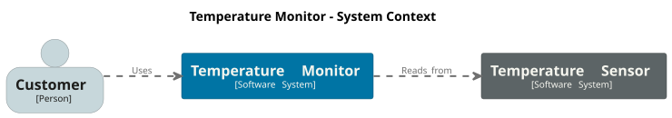
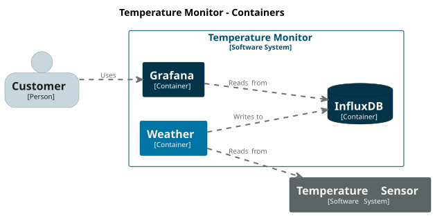

# Temperaturdaten-Projekt
Euer Projekt ist es kumulierte Temperaturdaten von [Temperatursensoren](http://127.0.0.1:5000/temperatur) abzufragen. Diese Daten müssen in einer Datenbank gespeichert werden um den zeitlichen Verlauf anzeigen zu können. Die gespeichertden Daten müssen von der Datenbank abgefragt und grafisch dargestellt werden. Die Datenbank und das Tool zur grafischen Darstellung müssen aufgesetzt, eingerichtet und in einer Container-Umgebung ausgeführt werden.

## Projektübersicht

1. **API-Abfrage**: Abrufen von Temperaturdaten mittels eines GET-Requests.
2. **Datenbank-Speicherung**: Speichern der abgerufenen Daten in einer InfluxDB.
3. **Visualisierung**: Anzeigen der gespeicherten Daten in Grafana.
4. **Docker-Container**: Ausführen von InfluxDB und Grafana in Docker-Containern.

## Tools
- Python
- Grafana
- Docker
- InfluxDB

## Schritte zur Umsetzung

### 1. API-Abfrage

- **Ziel**: Temperaturdaten abrufen.
- **Vorgehen**:
  - Überlegen Sie, wie Sie eine Anfrage an die API senden können.
  - Achten Sie auf die richtige URL und erforderliche Parameter.

### 2. Speicherung in InfluxDB

- **Ziel**: Speichern der Daten.
- **Vorgehen**:
  - Erforschen Sie Möglichkeiten, um eine Verbindung zur Datenbank herzustellen.
  - Überlegen Sie, wie Sie die Daten strukturieren und speichern möchten.

### 3. Visualisierung in Grafana

- **Ziel**: Daten visualisieren.
- **Vorgehen**:
  - Erkunden Sie, wie Sie ein Dashboard erstellen können.
  - Überlegen Sie, welche Art von Diagrammen oder Panels sinnvoll sind.

### 4. Docker-Container

- **Ziel**: Container-Betrieb.
- **Vorgehen**:
  - Informieren Sie sich über das Erstellen von Docker-Containern.
  - Überlegen Sie, wie Sie die Dienste konfigurieren und starten können.
